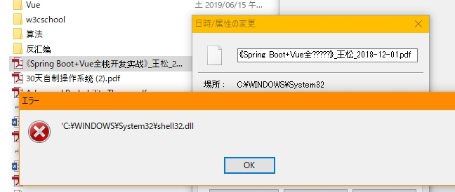

# FileTimeChanger
+ Change File's Create Time & Update Time & Access Time
+ Use `Qt` and `Windows API` to build this program

### Environment
+ `QT 5.5.1 32-bit (MSVC 2010)`
+ `Windows 10 Version 1803`

### Functions
+ [x] Modify files time using one time setting
+ [x] Modify files time using files property ref setting
+ [x] Drop files and dirs into ListView
+ [ ] Modify directories property

### Problems
+ Qt `QFileDialog` could not choose directories and files at the same time
+ (Through drop dirs can be accepted `event->mimeData()->hasFormat("text/uri-list")`)
+ Modify time more than one time will make `SetFileDateTime()` return `false`

### ScreenShot

### Reference
+ Refer to the [FileAge](https://www.vector.co.jp/soft/win95/util/se233362.html)
+ (Could not support simplified Chinese and some other symbols, LE tool also could not work well)

